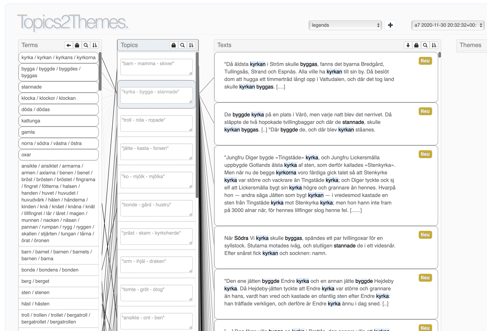

# Topics2Themes

Topics2Themes is a visual analysis tool for computer-assisted coding of frequently occurring topics in collections of text documents. The tool in mainly built on topic modelling, but also on clustering of word embeddings and on nearest neighbour classification.

The tool has been constructed by researchers at Linnaeus University, Potsdam University, Hokkaido University and the Institute for Language and Folklore. (For people involved, see publication list below.)

GUI example from ''Snippets of Folk Legends: Adapting a Text Mining Tool to a Collection of Folk Legends'' by Maria Skeppstedt, Rickard Domeij and Fredrik Skott.

## Publications

* Ahltorp, M., D&uuml;rlich L., Skeppstedt, M. 2021. Textual Contexts for "Democracy": Using Topic- and Word-Models for Exploring Swedish Government Official Reports. pp 49-56. 1st Workshop on Computational Linguistics for Political and Social Sciences (CPSS)
[pdf](https://old.gscl.org/en/arbeitskreise/cpss/cpss-2021/workshop-proceedings)
* Skeppstedt, M., Ahltorp, M., Eriksson, G., Domeij, R. 2021. A Pipeline for Manual Annotations of
Risk Factor Mentions in the COVID-19 Open
Research Dataset. Selected Papers from the
CLARIN Annual Conference 2020. pp 214-225.
[pdf](https://ecp.ep.liu.se/index.php/clarin/article/view/23/23)
* Skeppstedt, M., Domeij R., Skott F. 2021. Snippets of
Folk Legends: Adapting a
Text Mining Tool to a
Collection of Folk Legends. Post-Proceedings of the 5th Conference Digital Humanities in the Nordic Countries (DHN 2020).
[pdf](http://ceur-ws.org/Vol-2865/poster5.pdf)
* Skeppstedt, M., Domeij, R., and Skott F. 2020. Adapting a Topic Modelling Tool to the Task of Finding Recurring Themes in Folk Legends. 2020. Proceedings of the Digital Humanities in the Nordic Countries 5th Conference (DHN 2020). pp. 388-392.
[pdf](http://ceur-ws.org/Vol-2612/poster3.pdf)
* Skeppstedt, M., Ahltorp, M., Eriksson, G., Domeij, R. 2020. Annotating risk factor mentions in the COVID-19 Open Research Dataset. Proceedings of CLARIN Annual Conference 2020. pp. 52-55.
[pdf](https://office.clarin.eu/v/CE-2020-1738-CLARIN2020_ConferenceProceedings.pdf)
* Skeppstedt, M., Ahltorp, M., Kostiantyn, K., Kerren, A., Rzepka, R., Araki, K. 2020. Topic modelling applied to a second language: A language adaption and tool evaluation study. Selected Papers from the CLARIN Annual Conference 2019. pp. 145-156.
[pdf](https://ep.liu.se/en/conference-article.aspx?series=ecp&issue=172&Article_No=17)
* Skeppstedt, M., Ahltorp, M., Kerren, A., Rzepka, R., Araki, K. 2019. Application of a topic model visualisation tool to a second language. Book of Abstracts of the CLARIN Annual Conference 2019. Leipzig, Germany.
[pdf](http://cs.lnu.se/isovis/pubs/docs/skeppstedt-clarin19.pdf)
* Skeppstedt, M., Kerren, A., Stede, M. 2019. Finding Reasons for Vaccination Hesitancy: Evaluating Semi-Automatic Coding of Internet Discussion Forums. MEDINFO 2019: Health and Wellbeing e-Networks for All: Proceedings of the 17th World Congress on Medical and Health Informatics. pp. 348-352.
[pdf](http://ebooks.iospress.nl/publication/52006)
* Skeppstedt, M., Stede, M., Kerren, A. 2018. Stance-Taking in Topics Extracted from Vaccine-Related Tweets and Discussion Forum Posts. Proceedings of the 2018 EMNLP Workshop SMM4H : The 3rd Social Media Mining for Health Applications Workshop and Shared Task. pp. 5-8.
[pdf](https://aclweb.org/anthology/W18-5902)
* Kucher, K., Skeppstedt, M., Kerren, A. 2018. Application of Interactive Computer-Assisted Argument Extraction to Opinionated Social Media Texts. Proceedings of the 11th International Symposium on Visual Information Communication and Interaction (VINCI '18). pp. 102-103.
* Skeppstedt, M., Kucher, K., Stede, M., Kerren, A. 2018. Topics2Themes: Computer-assisted argument extraction
by visual analysis of important topics. Proceedings of the 3rd Workshop on Visualization as Added Value in the Development, Use and Evaluation of Language Resources (VisLR III)
[pdf](http://lrec-conf.org/workshops/lrec2018/W16/pdf/2_W16.pdf)
                
Note: The name of the repository was recently changed. It still works to clone from and push to the repository using the old name, but to avoid confusion, it can be good to do:

git remote set-url origin https://github.com/mariask2/topics2themes.git

Application of topic modelling functionality in Scikit-learn.

Given that you have a conda environment named topic_modelling where you have installed the following:

conda install numpy

conda install scipy

conda install scikit-learn

conda install gensim

conda install -c anaconda mongodb

conda install -c anaconda pymongo

conda install nltk

conda install joblib

pip install Flask

pip install -U flask-cors

If you want to plot extracted terms, you also need:

conda install matplotlib
conda install -c conda-forge adjusttext

When you run the code the first time, you'll get the following error message:

Resource punkt not found.
  Please use the NLTK Downloader to obtain the resource:
  >>> import nltk
  >>> nltk.download('punkt')

Follow the NLTK instructions to fix this

******
To run the code you need a mongdodb server to be running.

To achieve that, create the directory where the data is to be saved, e.g., “data/db
Then start the server giving that directory as a parameter:
mongod --dbpath data/db/
(mongodb listenes as default on port 27017. Currently that port is assumed to be the one used)

You write the following to run the code:

To run the topic modell as a flask server, you write:

python restful_api_topic_modelling.py <port>

for instance:

python restful_api_topic_modelling.py 5000

***************
You will need a file in the same directory from the code it is run, which is called "approved_keys.txt".
Here you put the allowed keys that the user of the user interface need to input when promted (when the interface is started).
One allowed key per line, e.g.;
key1
key2
key3

****************
The text collections that are available to the user must be positioned in a folder named "data_folder".
Each text collection is positioned in a subfolder of "data_folder". This subfolder should, in turn, contain several subfolders for each of the dynamic labels of the data set. The example text collection "vaccination_constructed_data_marked" set  has three dynamic labels "for", "against" and "uncertain", and correspondingly three subfolders with these names. The actual text files, should be placed as ".txt"-files in these sub-folders. (only .txt-files will be used for topic modelling)

********
As a default, the "data_folder" is positioned as a subdirectory in the folder with the python code.
The variable "WORKSPACE_FOLDER" in the file "environment_configuration.py"  can, however, be changed to another location, and the "data_folder" can be positioned there.

**********

If you are using conda, don't forget to activate the environment, 

source activate <name of environment>

For instance:
source activate topic_modelling

You used to be able to create a model without
To create a new topic model for the data in the folders data_folder/vaccination_constructed_data
python make_topic_models.py --project data_folder.vaccination_constructed_data_marked
(This will not be save to the database, only written to a file)

Part of the code is inspired from:
https://medium.com/@aneesha/topic-modeling-with-scikit-learn-e80d33668730
